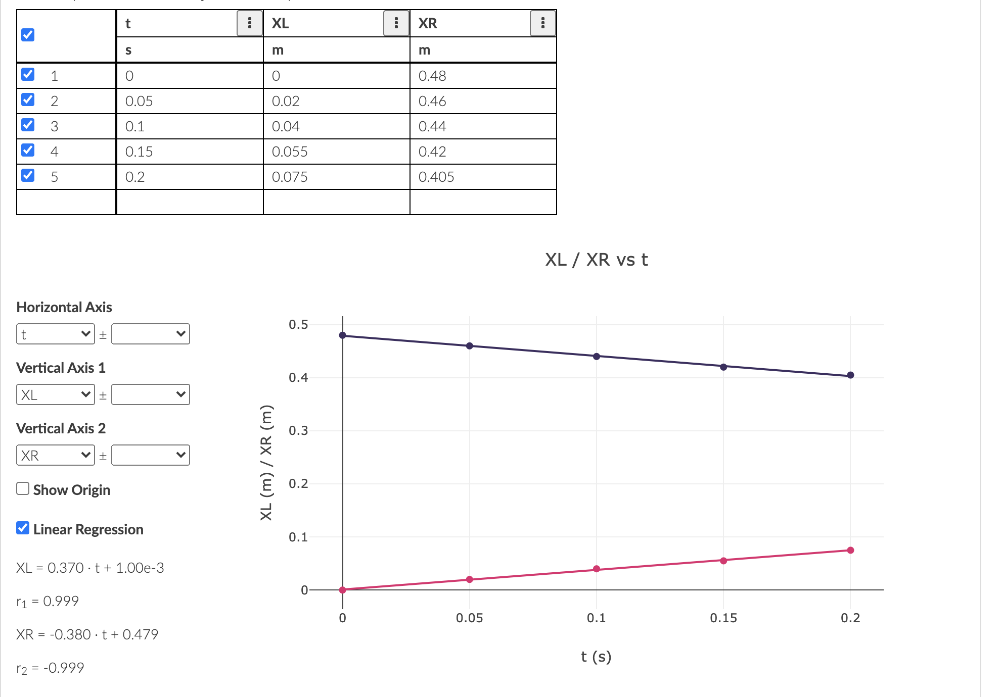
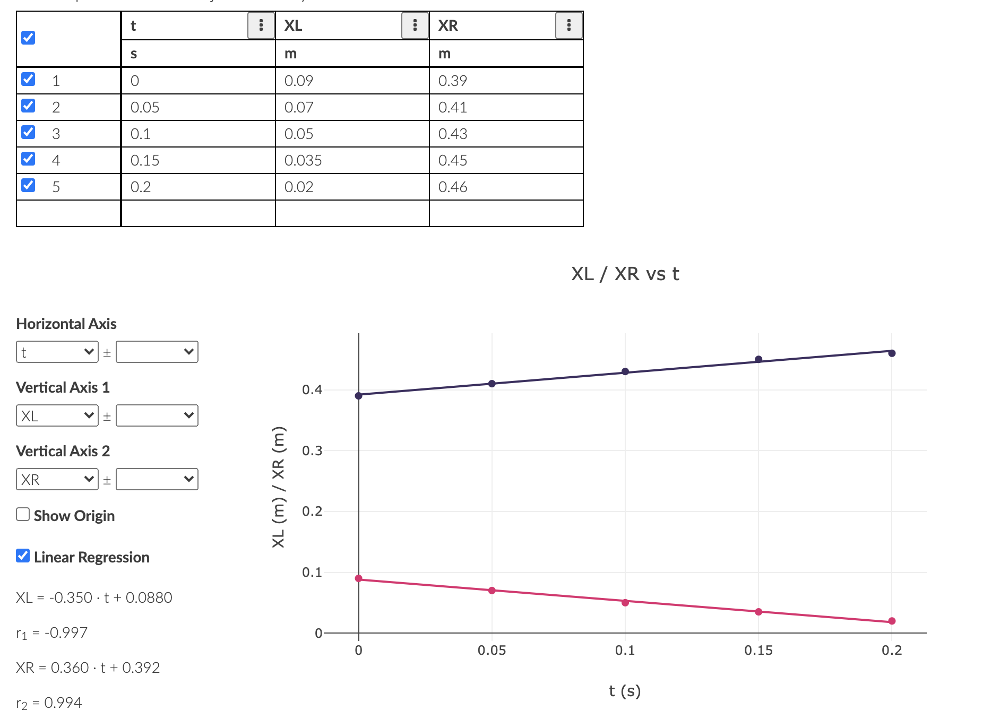
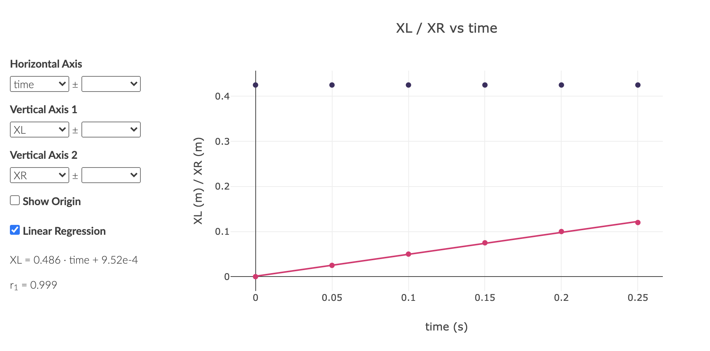
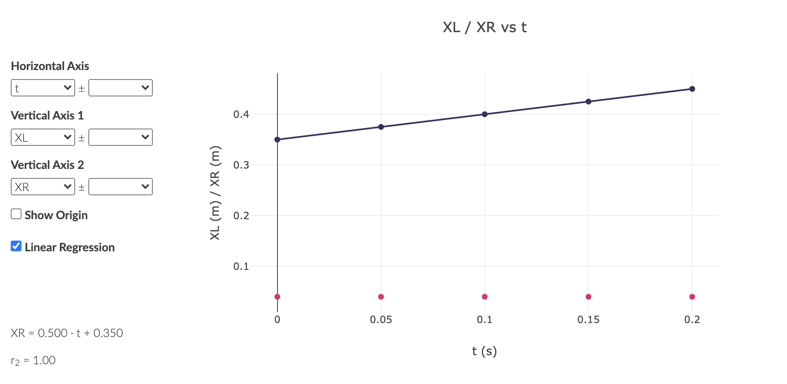
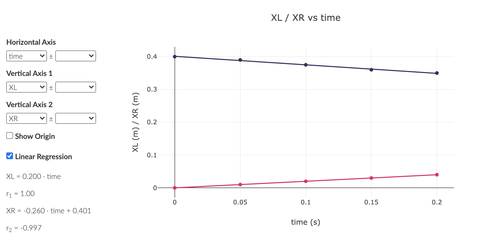
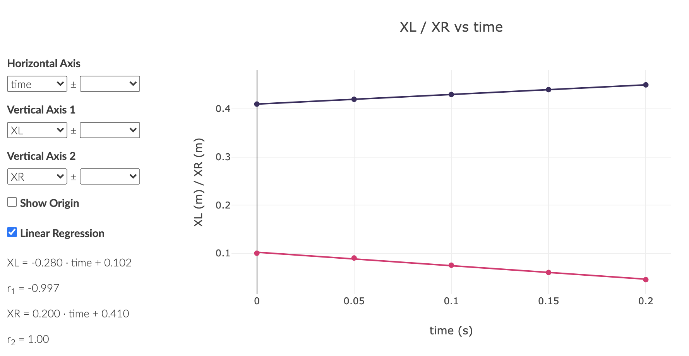
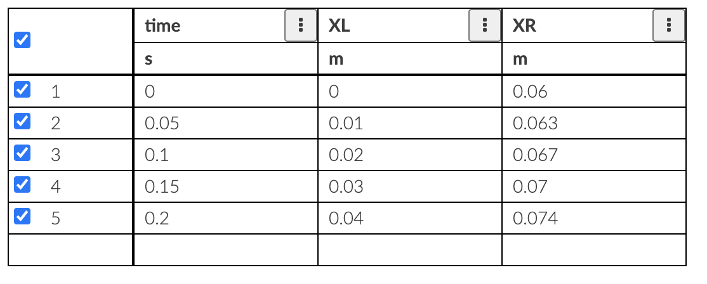
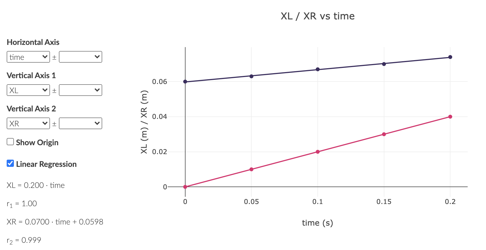
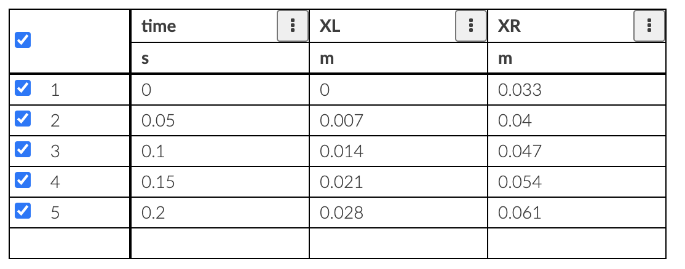
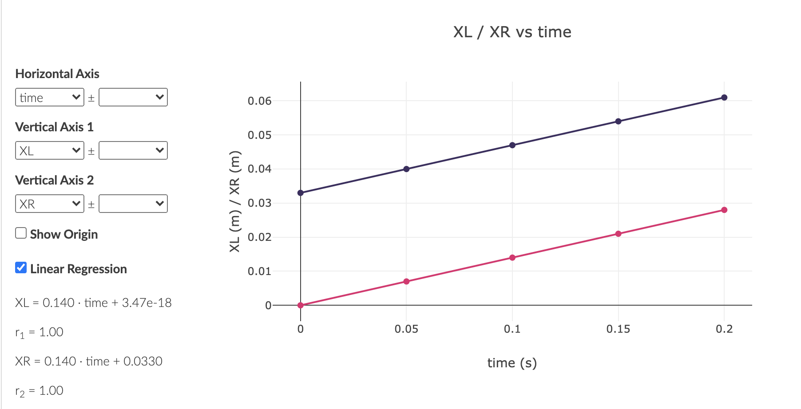

```{r setup, include=FALSE}
knitr::opts_chunk$set(echo = TRUE)
```

#Lab8: Conservation of Momentum

## Elastic Collision

### Both Moving with Same Speed

$$ m_R = m_L = 150g $$

#### Before Collision


####  After Collision


###  Right cart stationary
$$ m_R = m_L = 150g $$

####  Before Collision


####  After Collision

###  Right Car moving faster
$$ m_R = m_L = 150g $$

####  Before Collision


####  After Collision


# Inelastic Collision
$$ m_R = m_L = 200g $$
####  Before Collision



